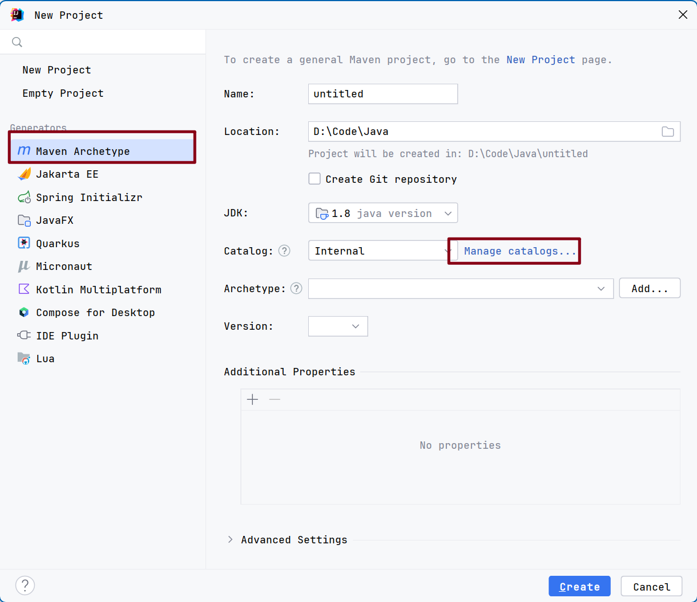
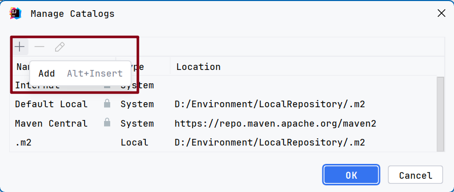
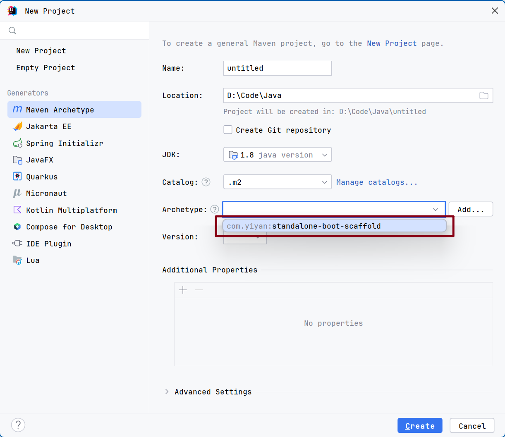
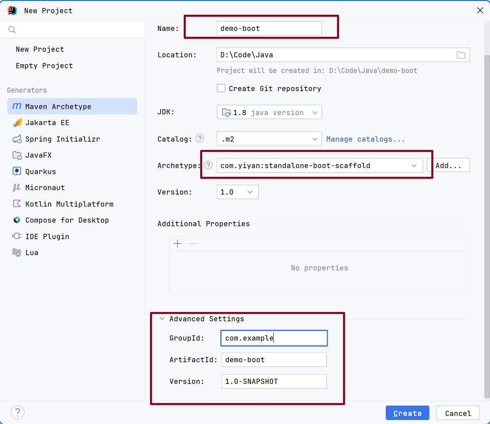
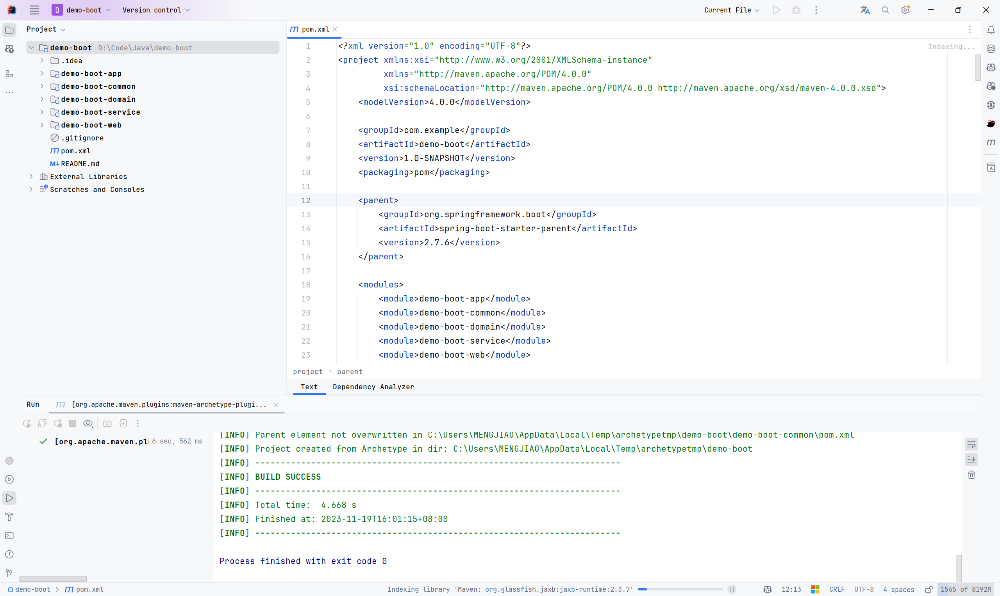
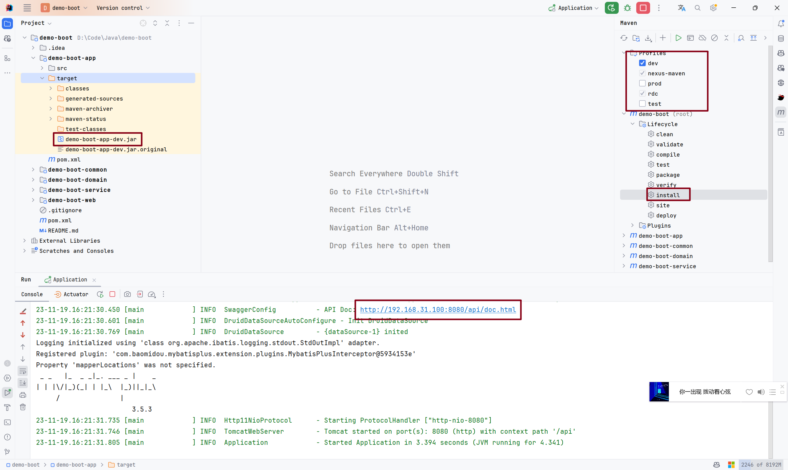
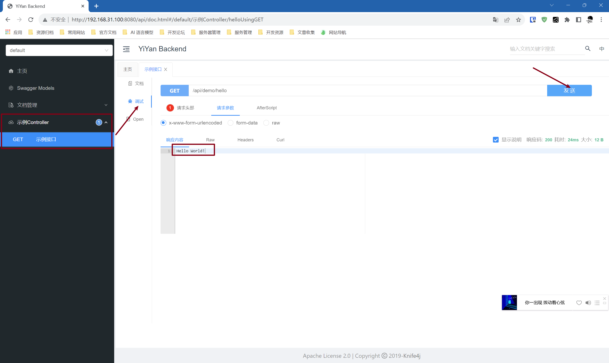

# standalone-boot-archetype - Spring Boot 单体项目脚手架

## 1. 脚手架安装使用

### 1. 生成

拉取本仓库代码，进入到项目根目录，执行如下命令：

```shell
mvn clean install
```

### 2. 使用

以IDEA 为例
1. 将本地maven仓库添加到IDEA的archetype配置中
   
   
2. 选择脚手架
   
3. 填写项目信息，然后创建项目
   
4. 项目创建成功，等待依赖导入
   
5. 启动项目，因为项目采用多环境配置，所以需要指定环境变量
   
6. 项目启动成功后会输出上图的Swagger地址，访问测试接口，至此完成项目创建，根据业务需求进行开发即可
   